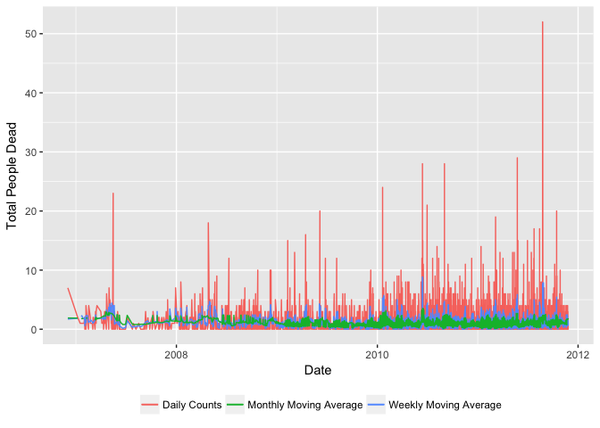
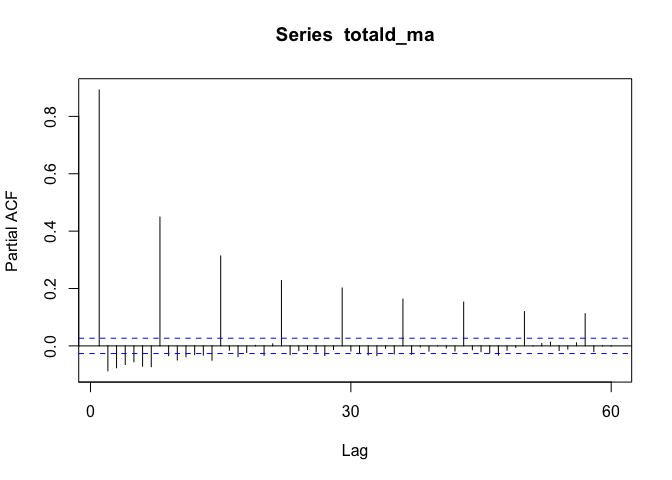
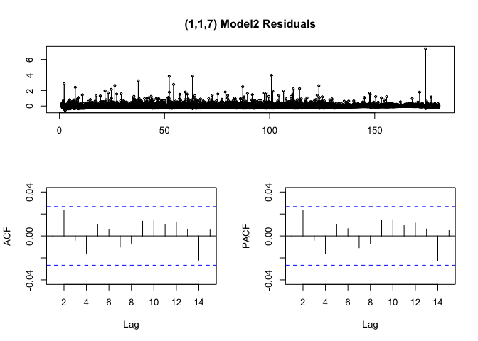

An Analysis of Violence Data
================

The goal here is to predict "perfect lethality" based on some features in our data set such as; number of people dead and wounded in an event, what type of guns seized and who participated to the event. The covariates are: "total\_people\_dead", "total\_people\_wounded", "long\_guns\_seized", "small\_arms\_seized", "cartridge\_sezied", "clips\_seized", "afi", "army", "navy", "federal\_police", "state\_police" Outcome: "perfect\_lethality"

First, we split our data into a training (60%) and testing (40%) data sets so we can assess how well our model performs in an out-of-sample data set.

``` r
set.seed(0) #for replicability, always set a seed!
n <- dim(AllData)[1]
ntest <- round(n*0.4) #size of testing data
tindex <- sample(n,ntest) # indices of testing samples
data_test<- AllData[tindex,]
data_train <- AllData[-tindex,]
data_train$perfect_lethality <- as.factor(data_train$perfect_lethality)
data_test$perfect_lethality <- as.factor(data_test$perfect_lethality)
```

**Logistic Regression**
-----------------------

Fit a model on the training data to predict perfect\_lethality

``` r
model_lg = glm(formula = perfect_lethality ~ total_people_dead + 
                 total_people_wounded + long_guns_seized+ small_arms_seized +
                 cartridge_sezied+ clips_seized+ afi+ army + navy + 
                 federal_police + state_police, 
               family = binomial(link = "logit"), 
               data = data_train)
```

``` r
summary(model_lg)
```

    ## 
    ## Call:
    ## glm(formula = perfect_lethality ~ total_people_dead + total_people_wounded + 
    ##     long_guns_seized + small_arms_seized + cartridge_sezied + 
    ##     clips_seized + afi + army + navy + federal_police + state_police, 
    ##     family = binomial(link = "logit"), data = data_train)
    ## 
    ## Deviance Residuals: 
    ##     Min       1Q   Median       3Q      Max  
    ## -8.4904  -0.6456  -0.4460   0.3928   4.1254  
    ## 
    ## Coefficients:
    ##                        Estimate Std. Error z value Pr(>|z|)    
    ## (Intercept)          -2.258e+00  9.191e-02 -24.568  < 2e-16 ***
    ## total_people_dead     8.334e-01  3.844e-02  21.682  < 2e-16 ***
    ## total_people_wounded -5.746e-01  4.406e-02 -13.041  < 2e-16 ***
    ## long_guns_seized      2.278e-02  1.771e-02   1.286    0.198    
    ## small_arms_seized     4.447e-02  3.466e-02   1.283    0.200    
    ## cartridge_sezied     -6.068e-05  4.753e-05  -1.277    0.202    
    ## clips_seized          1.421e-03  1.457e-03   0.976    0.329    
    ## afi                   1.460e+00  1.227e+00   1.190    0.234    
    ## army                  1.328e+00  1.097e-01  12.113  < 2e-16 ***
    ## navy                  1.136e+00  2.584e-01   4.397  1.1e-05 ***
    ## federal_police        3.745e-01  1.647e-01   2.273    0.023 *  
    ## state_police          6.353e-02  2.010e-01   0.316    0.752    
    ## ---
    ## Signif. codes:  0 '***' 0.001 '**' 0.01 '*' 0.05 '.' 0.1 ' ' 1
    ## 
    ## (Dispersion parameter for binomial family taken to be 1)
    ## 
    ##     Null deviance: 3868.6  on 3237  degrees of freedom
    ## Residual deviance: 2686.4  on 3226  degrees of freedom
    ## AIC: 2710.4
    ## 
    ## Number of Fisher Scoring iterations: 6

The estimates from logistic regression define the relationship between the predictor and response variable on a log-odds scale. So here, the model indicates that for every one unit increase in long guns seized in an event, the log-odds of having perfect lethality increases by 0.0228. Log-odds are not very informative that's why we take exponential to obtain odds ratio.

``` r
exp(coef(model_lg))
```

    ##          (Intercept)    total_people_dead total_people_wounded 
    ##            0.1045538            2.3010191            0.5629216 
    ##     long_guns_seized    small_arms_seized     cartridge_sezied 
    ##            1.0230419            1.0454726            0.9999393 
    ##         clips_seized                  afi                 army 
    ##            1.0014225            4.3077775            3.7749568 
    ##                 navy       federal_police         state_police 
    ##            3.1148206            1.4542138            1.0655911

So every one unit increase in long\_gun\_seized, the odds of having perfect lethality increases by a factor of 1.023.

Let's evaluate our model on a new dataset.

``` r
pred_probs<-predict(model_lg, newdata = data_test, type = "response") # probabilities 
pred <-prediction(pred_probs, data_test$perfect_lethality) # fpr, tpr, and labels
perf_lg <- performance(pred,"tpr","fpr")
plot(perf_lg)
```


``` r
##Area under ROC curve
performance(pred, "auc")@y.values[[1]]  #LogReg
```

    ## [1] 0.8608628

We have 86.09% testing accuracy for logistic regression model.

``` r
prob_tr<-predict(model_lg, newdata = data_train, type = "response") #this gives us probabilities
pred_tr <-prediction(prob_tr, data_train$perfect_lethality)
performance(pred_tr, "auc")@y.values[[1]]
```

    ## [1] 0.8879566

Note that our model has a higher **training** accuracy than **test** accuracy. Even though the difference is small, this might be due to **overfitting**.

It is also important to note that this result is obtained based on the manual training and test split that we performed above. To get more precise score we need to run some kind of cross-validation.

**10 Fold Cross-Validation**

``` r
fit <- glm(formula = perfect_lethality ~ total_people_dead+ 
             total_people_wounded + long_guns_seized+ 
             small_arms_seized+ cartridge_sezied+ 
             clips_seized+ afi+ army+ navy+ 
             federal_police+ state_police, 
           family = binomial(link = "logit"),
           data = AllData)
```

    ## Warning: glm.fit: fitted probabilities numerically 0 or 1 occurred

``` r
boot::cv.glm(AllData, fit, K=10)$delta[1]
```

    ## [1] 0.1199436

The cross validation estimate of prediction error is 0.1199. Thus, we obtained a better accuracy with 10-fold cross validation.

Can we get better prediction accuracy? Let's improve our model.

**Random Forest**
-----------------

We can try a different classifier, and apply it using the exact same variables as in the previous specificiation.

``` r
model_rf = randomForest(perfect_lethality ~ total_people_dead + 
                          total_people_wounded + long_guns_seized + 
                          small_arms_seized + cartridge_sezied + 
                          clips_seized + afi + army + navy + 
                          federal_police + state_police , 
                        data = data_train, 
                        importance=TRUE, 
                        proximity=TRUE)
print(model_rf)
```

    ## 
    ## Call:
    ##  randomForest(formula = perfect_lethality ~ total_people_dead +      total_people_wounded + long_guns_seized + small_arms_seized +      cartridge_sezied + clips_seized + afi + army + navy + federal_police +      state_police, data = data_train, importance = TRUE, proximity = TRUE) 
    ##                Type of random forest: classification
    ##                      Number of trees: 500
    ## No. of variables tried at each split: 3
    ## 
    ##         OOB estimate of  error rate: 11.43%
    ## Confusion matrix:
    ##      0   1 class.error
    ## 0 2201 115  0.04965458
    ## 1  255 667  0.27657267

``` r
pred_probs_rf <-predict(model_rf, data_test, type='prob' )[,2]
pred_rf<-prediction(pred_probs_rf, data_test$perfect_lethality)
perf_rf <- performance(pred_rf,"tpr","fpr")

#plotting logistic regression vs random forest
plot(perf_lg,col='red',lty=1, main='ROC Logistic vs RF')
plot(perf_rf, col='blue',lty=2,add=TRUE)
legend(0.6,0.6,c('Logistic','RF'),col=c('red','blue'),lwd=3)
```


``` r
##Area under ROC curve
performance(pred_rf,"auc")@y.values[[1]]  #Random Forest
```

    ## [1] 0.9164398

``` r
performance(pred, "auc")@y.values[[1]]  #LogReg
```

    ## [1] 0.8608628

Our **random forest** performs better than the **logistic regression** model, per the comparison in the test data.

**A look into Time Series Analysis**
------------------------------------

This is clearly a data set with an inherent **time dimension**, which we could also explicitly use to generate predictions. In this case, we would like to see the how "total number of dead" changes over **time** and predict future values based on previously observed ones (forecasting).

``` r
AllData$Date = as.Date(AllData$date)
ggplot(AllData, aes(Date, total_people_dead)) +
       geom_line() + 
  scale_x_date('month') + 
  ylab("Total people dead") + xlab("")
```


We can start by smoothing the data by including weekly and monthly moving averages;

``` r
AllData$totaldead_ma = ma(AllData$total_people_dead, order=7) #Weekly
AllData$totaldead_ma30 = ma(AllData$total_people_dead, order=30) #Monthly

ggplot() + 
  geom_line(data = AllData, 
            aes(x = Date, y = total_people_dead, colour = "Daily Counts")) +
  geom_line(data = AllData, 
            aes(x = Date, y = totaldead_ma,   colour = "Weekly Moving Average"))+  
  geom_line(data = AllData, 
            aes(x = Date, y = totaldead_ma30, colour = "Monthly Moving Average"))+
  theme(legend.title = element_blank(), legend.position="bottom") + 
  ylab('Total People Dead')
```



Here we use the smoothed series of weekly moving average. Let's check for stationary;

``` r
totald_ma = ts(na.omit(AllData$totaldead_ma), frequency=30)
adf.test(totald_ma, alternative = "stationary")
```

    ## Warning in adf.test(totald_ma, alternative = "stationary"): p-value smaller
    ## than printed p-value

    ## 
    ##  Augmented Dickey-Fuller Test
    ## 
    ## data:  totald_ma
    ## Dickey-Fuller = -12.164, Lag order = 17, p-value = 0.01
    ## alternative hypothesis: stationary

The augmented Dickey Fuller test rejects the null hypothesis of non-stationary.

``` r
Acf(totald_ma)
```


``` r
Pacf(totald_ma)
```



``` r
mod <- auto.arima(totald_ma, seasonal=FALSE)
tsdisplay(residuals(mod), lag.max=15, main='(1,1,0) Model Residuals')
```


There is a pattern in ACF/PACF graphs repeating at lag 7. We should redefine our arima model.

``` r
mod2 <- arima(totald_ma, order=c(1,1,7))
tsdisplay(residuals(mod2), lag.max=15, main='(1,1,7) Model2 Residuals')
```



This is better. Let's do forecasting with our model.

``` r
fcast <- forecast(mod2, h=730) # forecasting 2 years
plot(fcast)
```


The blue line displays the fit provided by the model. It seems naive, because the blue line quickly gets closer to a straight line and does not carry out the trend of the past. There are various ways to improve this model such as removing seasonality, checking trend and historic events or adding predictors and fitting and ARMAX model.
